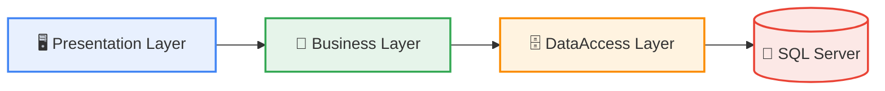
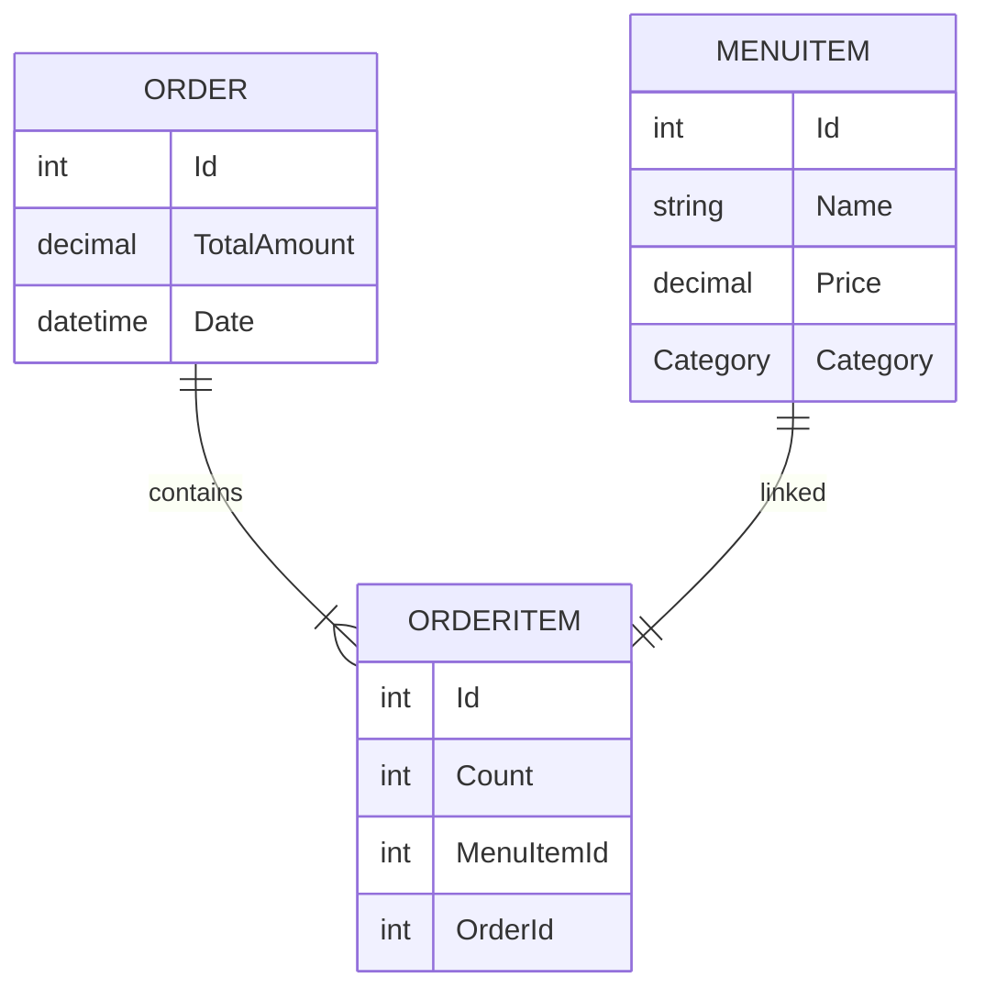
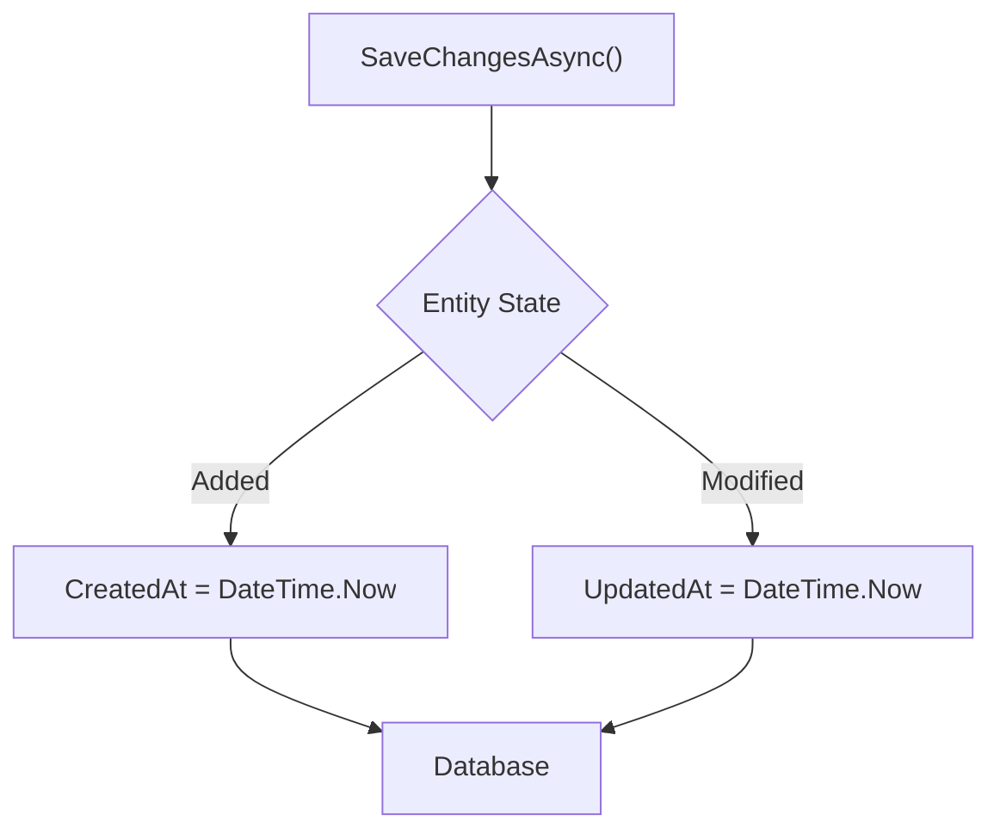
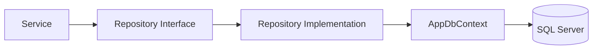
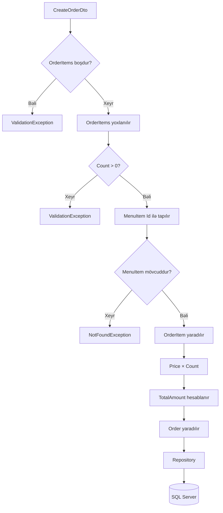
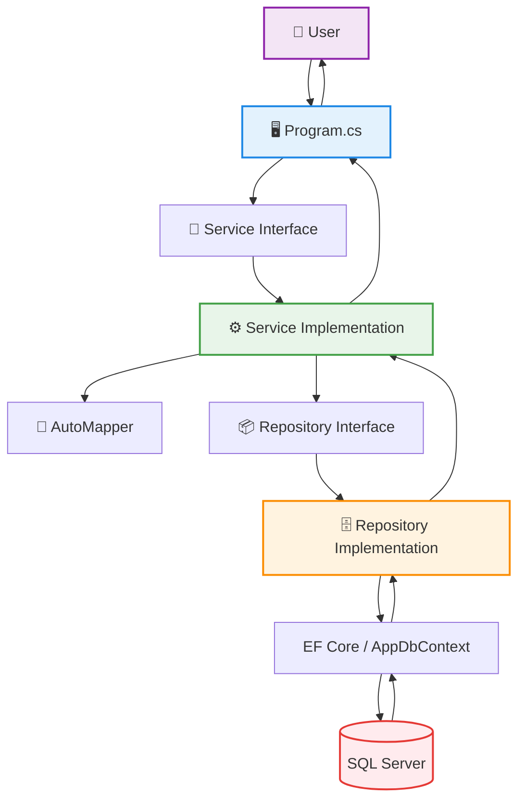
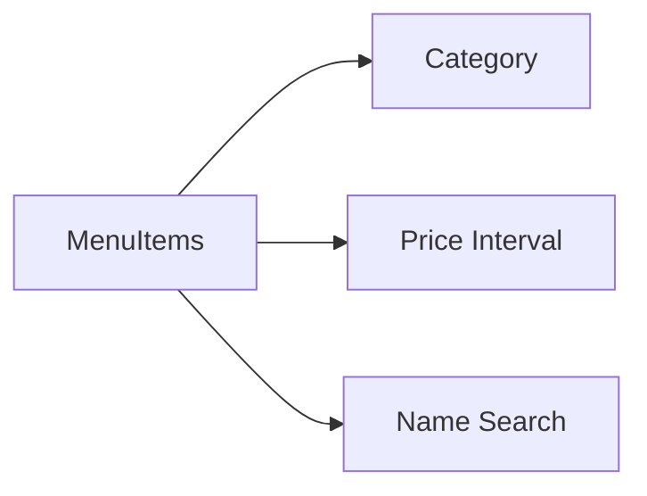
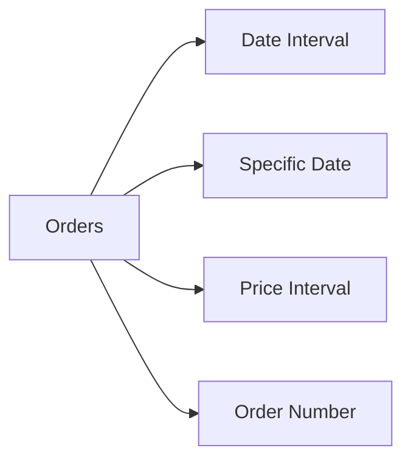
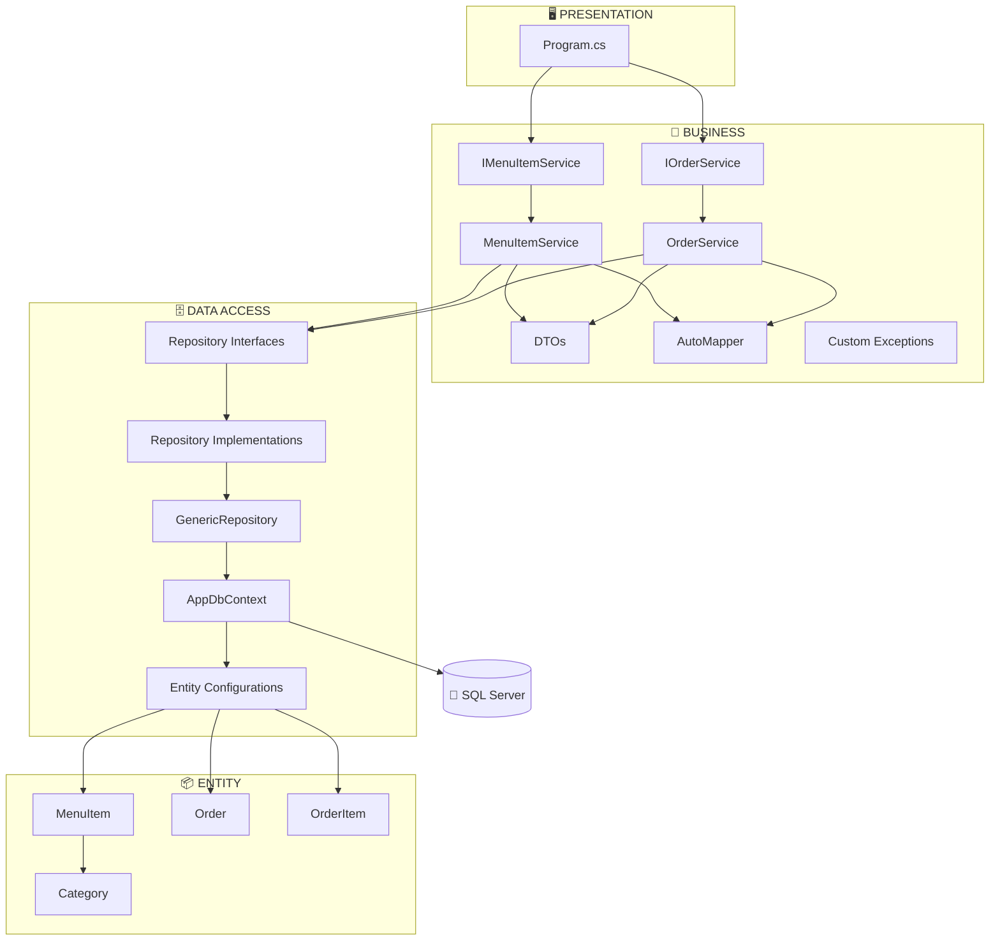

# 🍽️ Restaurant Order Management System

<div align="center">

### N-Tier Architecture ilə hazırlanmış Restoran Sifariş İdarəetmə Sistemi


</div>

---

## 📌 Layihə haqqında

**RestaurantApp** restorandakı menyu məhsullarının və sifarişlərin idarə olunması üçün hazırlanmış Console Application layihəsidir.

Layihə sadəcə CRUD əməliyyatlarını yerinə yetirmək üçün deyil, eyni zamanda proqramın müxtəlif məsuliyyətlərini ayrı qatlara bölərək daha səliqəli, idarəolunan və genişləndirilə bilən arxitektura yaratmaq məqsədi ilə hazırlanmışdır.

Layihədə əsasən aşağıdakı texnologiya və yanaşmalardan istifadə olunub:

- C#
- .NET
- N-Tier Architecture
- Entity Framework Core
- SQL Server
- Repository Pattern
- Generic Repository Pattern
- DTO Pattern
- AutoMapper
- Entity Configurations
- Service Layer
- Custom Exceptions
- Async / Await
- LINQ
- Console UI

---

# 🎯 Layihənin əsas məqsədi

Sistem istifadəçiyə restoran menyusu və sifarişləri üzərində müxtəlif əməliyyatlar aparmağa imkan verir.

### MenuItem əməliyyatları

- Yeni məhsul əlavə etmək
- Mövcud məhsulu dəyişmək
- Məhsulu silmək
- Bütün məhsulları göstərmək
- Kateqoriyaya görə filter etmək
- Qiymət aralığına görə filter etmək
- Ada görə axtarış aparmaq

### Order əməliyyatları

- Yeni sifariş yaratmaq
- Sifarişi ləğv etmək
- Bütün sifarişləri göstərmək
- Tarix aralığına görə sifarişləri göstərmək
- Məbləğ aralığına görə sifarişləri göstərmək
- Konkret tarixə görə sifarişləri göstərmək
- Sifariş nömrəsinə görə tam məlumatı göstərmək

---

# 🏗️ Architecture

Layihə **N-Tier Architecture** prinsipi əsasında 4 əsas project-ə bölünüb.



### Layer-lərin məsuliyyəti

| Layer | Məsuliyyəti |
|---|---|
| `RestaurantApp.Entity` | Entity-lər, Base class-lar və Enum-lar |
| `RestaurantApp.DataAccess` | Database, DbContext, Configurations və Repository-lər |
| `RestaurantApp.Business` | DTO, Service, Mapping və Business Validation |
| `RestaurantApp.Presentation` | Console menyusu və istifadəçi ilə əlaqə |

---

# 📂 Project Structure

```text
RestaurantApp
│
├── RestaurantApp.Entity
│   │
│   └── Entities
│       ├── Common
│       │   ├── BaseEntity.cs
│       │   └── AuditEntity.cs
│       │
│       ├── Enums
│       │   └── Category.cs
│       │
│       ├── MenuItem.cs
│       ├── Order.cs
│       └── OrderItem.cs
│
├── RestaurantApp.DataAccess
│   │
│   ├── Context
│   │   └── AppDbContext.cs
│   │
│   ├── Configurations
│   │   ├── MenuItemConfiguration.cs
│   │   ├── OrderConfiguration.cs
│   │   └── OrderItemConfiguration.cs
│   │
│   ├── Repositories
│   │   ├── Interfaces
│   │   │   ├── IGenericRepository.cs
│   │   │   ├── IMenuItemRepository.cs
│   │   │   └── IOrderRepository.cs
│   │   │
│   │   └── Implementations
│   │       ├── GenericRepository.cs
│   │       ├── MenuItemRepository.cs
│   │       └── OrderRepository.cs
│   │
│   └── Migrations
│
├── RestaurantApp.Business
│   │
│   ├── DTOs
│   │   │
│   │   ├── MenuItems
│   │   │   ├── CreateMenuItemDto.cs
│   │   │   ├── UpdateMenuItemDto.cs
│   │   │   └── MenuItemDto.cs
│   │   │
│   │   └── Orders
│   │       ├── CreateOrderDto.cs
│   │       ├── CreateOrderItemDto.cs
│   │       ├── UpdateOrderDto.cs
│   │       ├── OrderDto.cs
│   │       ├── OrderDetailDto.cs
│   │       └── OrderItemDto.cs
│   │
│   ├── Exceptions
│   │   ├── AlreadyExistsException.cs
│   │   ├── NotFoundException.cs
│   │   └── ValidationException.cs
│   │
│   ├── MappingProfiles
│   │   └── AppMappingProfile.cs
│   │
│   └── Services
│       ├── Interfaces
│       │   ├── IMenuItemService.cs
│       │   └── IOrderService.cs
│       │
│       └── Implementations
│           ├── MenuItemService.cs
│           └── OrderService.cs
│
└── RestaurantApp.Presentation
    └── Program.cs
```

---

# 1️⃣ Entity Layer

`RestaurantApp.Entity` layihənin əsas domain modellərini saxlayır.

Bu layer database əməliyyatları və business logic ilə məşğul olmur.

---

## `BaseEntity`

Bütün entity-lər üçün ortaq olan `Id` property-sini saxlayır.

```csharp
public class BaseEntity
{
    public int Id { get; set; }
}
```

Bu yanaşma sayəsində hər entity daxilində ayrıca `Id` yazmağa ehtiyac qalmır.

---

## `AuditEntity`

`BaseEntity`-dən miras alır və yaradılma/yenilənmə tarixlərini saxlayır.

```csharp
public class AuditEntity : BaseEntity
{
    public DateTime CreatedAt { get; set; }
    public DateTime? UpdatedAt { get; set; }
}
```

### Property-lər

- `CreatedAt` — obyektin yaradıldığı tarix
- `UpdatedAt` — obyektin son yeniləndiyi tarix

Bu dəyərlər `AppDbContext.SaveChangesAsync()` daxilində avtomatik idarə olunur.

---

## `Category`

Menyu məhsullarının kateqoriyalarını enum şəklində saxlayır.

```csharp
public enum Category
{
    Soup = 1,
    Salad = 2,
    Starter = 3,
    MainCourse = 4,
    FastFood = 5,
    Dessert = 6,
    HotDrink = 7,
    ColdDrink = 8
}
```

---

## `MenuItem`

Restoran menyusundakı məhsulu təmsil edir.

```csharp
public class MenuItem : AuditEntity
{
    public string Name { get; set; }
    public decimal Price { get; set; }
    public Category Category { get; set; }

    public OrderItem? OrderItem { get; set; }
}
```

### Əsas məlumatlar

- `Id`
- `Name`
- `Price`
- `Category`
- `CreatedAt`
- `UpdatedAt`

---

## `OrderItem`

Sifariş daxilində seçilmiş məhsulu və sayını saxlayır.

```csharp
public class OrderItem : BaseEntity
{
    public int Count { get; set; }

    public int MenuItemId { get; set; }
    public MenuItem MenuItem { get; set; }

    public int OrderId { get; set; }
    public Order Order { get; set; }
}
```

Məsələn:

```text
Pizza × 2
Cola  × 4
```

iki fərqli `OrderItem` kimi saxlanıla bilər.

---

## `Order`

Restorana edilmiş sifarişi təmsil edir.

```csharp
public class Order : AuditEntity
{
    public List<OrderItem> OrderItems { get; set; }
        = new List<OrderItem>();

    public decimal TotalAmount { get; set; }

    public DateTime Date { get; set; }
}
```

### Əsas məlumatlar

- Sifariş nömrəsi
- Sifariş item-ları
- Ümumi məbləğ
- Sifariş tarixi

---

# 🔗 Entity Relationships

Layihədə müəllimin xüsusi tələbinə uyğun olaraq relation-lar aşağıdakı formada qurulub:



### Relation-lar

```text
MenuItem  1 ───── 1 OrderItem

Order     1 ───── * OrderItem
```

- `MenuItem ↔ OrderItem` → **One-to-One**
- `Order ↔ OrderItem` → **One-to-Many**

> Bu layihədə `MenuItem` və `OrderItem` arasında One-to-One əlaqəsi müəllimin xüsusi tələbinə əsasən qurulmuşdur.

---

# 2️⃣ DataAccess Layer

`RestaurantApp.DataAccess` database ilə birbaşa əlaqəyə cavabdehdir.

Bu layer-də:

- DbContext
- Entity Configurations
- Repository-lər
- EF Core
- SQL Server

istifadə olunur.

---

# 🗄️ AppDbContext

`AppDbContext` Entity Framework Core ilə database arasında əlaqə yaradır.

### DbSet-lər

```csharp
public DbSet<MenuItem> MenuItems { get; set; }

public DbSet<Order> Orders { get; set; }

public DbSet<OrderItem> OrderItems { get; set; }
```

Database-də uyğun olaraq 3 əsas table yaranır.

---

## SQL Server connection

```csharp
optionsBuilder.UseSqlServer(
    "Server=localhost;Database=RestaurantAppDb;Trusted_Connection=True;TrustServerCertificate=True;"
);
```

---

## Configurations

Bütün Entity Configuration class-ları assembly-dən avtomatik tətbiq edilir.

```csharp
modelBuilder.ApplyConfigurationsFromAssembly(
    typeof(AppDbContext).Assembly
);
```

---

## Audit sistemi

`SaveChangesAsync()` override olunub.



Beləliklə `MenuItemService` və `OrderService` daxilində hər dəfə tarixləri əl ilə yazmağa ehtiyac qalmır.

---

# ⚙️ Entity Configurations

Entity-lərin database qaydaları ayrıca configuration class-larında saxlanılır.

---

## `MenuItemConfiguration`

Burada:

- `Id` → Primary Key
- `Name` → Required
- `Name` → maksimum 100 simvol
- `Name` → Unique
- `Price` → `decimal(18,2)`
- `Category` → Required

qaydaları tətbiq olunur.

Unique index sayəsində eyni adda iki fərqli `MenuItem` database səviyyəsində də yaradıla bilməz.

---

## `OrderItemConfiguration`

Burada:

- `Id` → Primary Key
- `Count` → Required
- `MenuItem ↔ OrderItem` → One-to-One

relation qurulur.

---

## `OrderConfiguration`

Burada:

- `Id` → Primary Key
- `TotalAmount` → `decimal(18,2)`
- `Date` → Required
- `Order ↔ OrderItem` → One-to-Many

relation qurulur.

Order silindikdə ona aid `OrderItem`-lar da silinir:

```text
DeleteBehavior.Cascade
```

---

# 📦 Repository Pattern

Repository layer Business layer ilə database arasında vasitəçi rolunu oynayır.

Business layer birbaşa `DbContext` ilə işləmək əvəzinə repository interface-lərindən istifadə edir.



---

# `IGenericRepository<T>`

Bütün entity-lər üçün ortaq CRUD contract-ını müəyyən edir.

### Metodlar

```csharp
Task<List<T>> GetAllAsync();

Task<T?> GetByIdAsync(int id);

Task AddAsync(T entity);

Task UpdateAsync(T entity);

Task DeleteAsync(T entity);
```

Generic Repository sayəsində eyni CRUD kodlarının hər entity üçün yenidən yazılmasına ehtiyac qalmır.

---

# `GenericRepository<T>`

`IGenericRepository<T>` interface-ni implement edir.

Database table generic formada əldə olunur:

```csharp
_table = _context.Set<T>();
```

### Əsas əməliyyatlar

```text
GetAllAsync
GetByIdAsync
AddAsync
UpdateAsync
DeleteAsync
```

`GetAllAsync()` daxilində `AsNoTracking()` istifadə edilir.

Bu, yalnız oxuma məqsədi ilə gətirilən obyektlərin EF Core tərəfindən lazımsız şəkildə track edilməsinin qarşısını alır.

---

# `IMenuItemRepository`

Generic CRUD əməliyyatlarına əlavə olaraq `MenuItem` üçün xüsusi metodları müəyyən edir.

```text
GetByCategoryAsync
GetByPriceIntervalAsync
SearchByNameAsync
ExistsByNameAsync
```

---

# `MenuItemRepository`

Menu item-lar üçün xüsusi database sorğularını həyata keçirir.

### Category filter

```text
Category == seçilmiş category
```

### Price filter

```text
Price >= minPrice
Price <= maxPrice
```

### Search

Məhsulun adında istifadəçinin daxil etdiyi text axtarılır.

### Duplicate name yoxlanması

```text
ExistsByNameAsync
```

metodu eyni adda məhsul olub-olmadığını yoxlayır.

Update zamanı `excludeId` vasitəsilə dəyişdirilən obyekt özü yoxlamadan çıxarıla bilir.

---

# `IOrderRepository`

Order üçün xüsusi repository metodlarını müəyyən edir.

### Metodlar

```text
GetAllWithDetailsAsync
GetByIdWithDetailsAsync
GetByDatesIntervalAsync
GetByDateAsync
GetByPriceIntervalAsync
```

---

# `OrderRepository`

Order-ları detalları ilə birlikdə database-dən gətirir.

```csharp
.Include(x => x.OrderItems)
.ThenInclude(x => x.MenuItem)
```

Bu sayədə aşağıdakı struktur birlikdə yüklənir:

```text
Order
│
└── OrderItems
    │
    └── MenuItem
```

Beləliklə sifariş detallarında həm məhsulun Id-si, həm adı, həm də sayı göstərilə bilir.

---

# 3️⃣ Business Layer

`RestaurantApp.Business` layihənin əsas biznes qaydalarını idarə edir.

Burada:

- DTO-lar
- Services
- Custom Exceptions
- AutoMapper

yerləşir.

---

# 📄 DTO Pattern

DTO — **Data Transfer Object** deməkdir.

DTO-ların məqsədi Presentation layer ilə Business layer arasında yalnız lazım olan məlumatları daşımaqdır.

Entity-lər birbaşa istifadəçiyə təqdim edilmir.

---

# 🍕 MenuItem DTO-ları

## `CreateMenuItemDto`

Yeni məhsul əlavə ediləndə istifadə olunur.

| Property | İzah |
|---|---|
| `Name` | Məhsulun adı |
| `Price` | Qiyməti |
| `Category` | Kateqoriyası |

---

## `UpdateMenuItemDto`

Menu item update ediləndə istifadə olunur.

| Property | İzah |
|---|---|
| `Name` | Yeni ad |
| `Price` | Yeni qiymət |

Task-a uyğun olaraq update zamanı Category dəyişdirilmir.

---

## `MenuItemDto`

Menu item məlumatlarının istifadəçiyə göstərilməsi üçün istifadə olunur.

| Property | İzah |
|---|---|
| `Id` | Məhsul nömrəsi |
| `Name` | Məhsul adı |
| `Price` | Qiymət |
| `Category` | Kateqoriya |

---

# 🧾 Order DTO-ları

## `CreateOrderItemDto`

Yeni sifariş yaradılarkən hər məhsul üçün istifadə olunur.

```text
MenuItemId
Count
```

---

## `CreateOrderDto`

Yeni sifarişi təmsil edir.

```text
CreateOrderDto
│
└── List<CreateOrderItemDto>
```

---

## `UpdateOrderDto`

Order üzərində full CRUD dəstəyi üçün yaradılıb.

```text
List<CreateOrderItemDto> OrderItems
```

---

## `OrderDto`

Order-ların siyahı şəklində göstərilməsi üçün istifadə olunur.

| Property | İzah |
|---|---|
| `Id` | Sifariş nömrəsi |
| `TotalAmount` | Ümumi məbləğ |
| `ItemCount` | Ümumi məhsul sayı |
| `Date` | Sifariş tarixi |

---

## `OrderItemDto`

Sifarişin daxilindəki məhsulların göstərilməsi üçün istifadə olunur.

| Property | İzah |
|---|---|
| `MenuItemId` | Məhsul Id-si |
| `MenuItemName` | Məhsul adı |
| `Count` | Say |

---

## `OrderDetailDto`

Bir sifariş haqqında tam məlumatı göstərmək üçün istifadə olunur.

```text
OrderDetailDto
│
├── Id
├── TotalAmount
├── ItemCount
├── Date
│
└── OrderItems
    ├── MenuItemId
    ├── MenuItemName
    └── Count
```

---

# 🔄 AutoMapper

Mapping əməliyyatları:

```text
AppMappingProfile.cs
```

daxilində saxlanılır.

### MenuItem mappings

```text
CreateMenuItemDto → MenuItem

UpdateMenuItemDto → MenuItem

MenuItem → MenuItemDto
```

### Order mappings

```text
CreateOrderItemDto → OrderItem

OrderItem → OrderItemDto

CreateOrderDto → Order

Order → OrderDto

Order → OrderDetailDto
```

---

## Xüsusi mapping

`OrderItemDto` daxilindəki:

```text
MenuItemName
```

birbaşa `OrderItem` entity-də olmadığı üçün belə əldə edilir:

```text
OrderItem.MenuItem.Name
```

---

## ItemCount hesablanması

`Order` entity-də ayrıca `ItemCount` property-si saxlanılmır.

AutoMapper zamanı hesablanır:

```csharp
src.OrderItems.Sum(x => x.Count)
```

Məsələn:

```text
Pizza × 2
Cola  × 4
```

olduqda:

```text
ItemCount = 6
```

olur.

---

# ❗ Custom Exceptions

Business layer-də xüsusi exception class-ları yaradılıb.

Bu yanaşma səhvlərin növünü daha aydın müəyyən etməyə imkan verir.

---

## `ValidationException`

İstifadəçinin daxil etdiyi məlumat business qaydalarına uyğun olmadıqda istifadə olunur.

### Nümunələr

```text
Name boşdur
Price <= 0
Count <= 0
Minimum price > Maximum price
Start date > End date
Yanlış Category
```

---

## `NotFoundException`

Axtarılan məlumat database-də olmadıqda istifadə olunur.

### Nümunələr

```text
Menu item not found
Order not found
```

---

## `AlreadyExistsException`

Eyni məlumatın təkrar əlavə edilməsinin qarşısını almaq üçün istifadə olunur.

### Nümunə

```text
A menu item with this name already exists.
```

---

# 🧠 Service Layer

Service layer layihənin business logic hissəsidir.

Repository database əməliyyatını edir.

Service isə:

> "Bu əməliyyat hansı qaydalara uyğun həyata keçirilməlidir?"

sualına cavab verir.

---

# `IMenuItemService`

Menu item əməliyyatlarının contract-ını müəyyən edir.

```text
AddAsync
UpdateAsync
DeleteAsync
GetByIdAsync
GetAllAsync
GetByCategoryAsync
GetByPriceIntervalAsync
SearchAsync
```

---

# `MenuItemService`

Menu item-larla bağlı bütün business validation burada aparılır.

### Add zamanı yoxlanılır

```text
Name boş olmamalıdır
Price > 0 olmalıdır
Category valid olmalıdır
Name unique olmalıdır
```

Daha sonra:

```text
CreateMenuItemDto
        ↓
     AutoMapper
        ↓
     MenuItem
        ↓
   Repository
        ↓
    Database
```

---

## Update zamanı

Əvvəlcə `Id`-yə görə məhsul tapılır.

Tapılmasa:

```text
NotFoundException
```

atılır.

Sonra:

- yeni ad yoxlanılır
- yeni qiymət yoxlanılır
- duplicate name yoxlanılır
- DTO mövcud entity üzərinə map edilir
- repository vasitəsilə update olunur

---

# `IOrderService`

Order əməliyyatlarının contract-ını müəyyən edir.

```text
AddAsync
UpdateAsync
DeleteAsync
GetAllAsync
GetByIdAsync
GetByDatesIntervalAsync
GetByDateAsync
GetByPriceIntervalAsync
```

---

# `OrderService`

Sifarişlərin əsas business logic hissəsidir.

---

## Yeni sifariş yaradılması

Yeni order yaradılarkən aşağıdakı proses həyata keçirilir:



---

## TotalAmount hesablanması

Ümumi məbləğ istifadəçi tərəfindən daxil edilmir.

Service daxilində avtomatik hesablanır:

```text
TotalAmount += MenuItem.Price × Count
```

Məsələn:

```text
Pizza = 15 AZN × 2 = 30 AZN

Cola = 3 AZN × 4 = 12 AZN

TotalAmount = 42 AZN
```

---

# 🔁 Layihənin ümumi işləmə axını



---

# 🖥️ Presentation Layer

`RestaurantApp.Presentation` istifadəçi ilə proqram arasındakı əlaqəni idarə edir.

Əsas fayl:

```text
Program.cs
```

---

# Program başlanarkən

Əvvəlcə aşağıdakı obyektlər yaradılır:

```text
AppDbContext
      ↓
Repositories
      ↓
AutoMapper
      ↓
Services
      ↓
MainMenuAsync()
```

---

# Repository yaradılması

```text
IMenuItemRepository
        ↑
MenuItemRepository

IOrderRepository
        ↑
OrderRepository
```

Hər iki repository `AppDbContext` istifadə edir.

---

# Service yaradılması

```text
IMenuItemService
       ↑
MenuItemService
       │
       ├── IMenuItemRepository
       └── IMapper
```

Order service:

```text
IOrderService
     ↑
OrderService
     │
     ├── IOrderRepository
     ├── IMenuItemRepository
     └── IMapper
```

---

# 📋 Main Menu

Proqram başladıqda:

```text
======================================
       RESTAURANT ORDER SYSTEM
======================================

1. Menu operations
2. Order operations
0. Exit
```

göstərilir.

---

# 🍴 Menu Operations

```text
======================================
          MENU OPERATIONS
======================================

1. Add new item
2. Edit item
3. Delete item
4. Show all items
5. Show items by category
6. Show items by price interval
7. Search items by name
0. Back
```

---

# 🧾 Order Operations

```text
======================================
          ORDER OPERATIONS
======================================

1. Add new order
2. Cancel order
3. Show all orders
4. Show orders by date interval
5. Show orders by price interval
6. Show orders by date
7. Show order by number
0. Back
```

---

# 🛡️ Input Validation

Console daxilində istifadəçinin səhv məlumat daxil etməsi proqramın dayanmasına səbəb olmur.

Bunun üçün ayrıca helper metodlar yaradılıb.

### Integer

```text
ReadInt()
```

Daxil edilən məlumat integer olmayana qədər istifadəçidən yenidən məlumat istəyir.

---

### Positive Integer

```text
ReadPositiveInt()
```

Ədədin `0`-dan böyük olduğunu yoxlayır.

Əsasən sifariş sayı üçün istifadə edilir.

---

### Decimal

```text
ReadDecimal()
```

Qiymət məlumatlarının düzgün daxil edilməsini təmin edir.

Həm:

```text
12.50
```

həm də uyğun culture şəraitində:

```text
12,50
```

formatlarının işlənməsi nəzərə alınıb.

---

### String

```text
ReadString()
```

Boş məlumat daxil edilməsinin qarşısını alır.

---

### Date

```text
ReadDate()
```

Tarix formatı:

```text
dd.MM.yyyy
```

Məsələn:

```text
18.09.2026
```

---

# 🚨 Exception Handling

Presentation layer-də service-lərdən gələn custom exception-lar `try/catch` ilə tutulur.

```csharp
catch (ValidationException ex)
{
    PrintError(ex.Message);
}

catch (AlreadyExistsException ex)
{
    PrintError(ex.Message);
}

catch (NotFoundException ex)
{
    PrintError(ex.Message);
}
```

Beləliklə business error baş verdikdə proqram bağlanmır.

İstifadəçi düzgün error mesajı görür və proqram işləməyə davam edir.

---

# 🔍 Menu Search və Filter sistemi

Menu item-lar aşağıdakı kriteriyalara görə axtarıla bilər:



### Category

```text
Soup
Salad
Starter
MainCourse
FastFood
Dessert
HotDrink
ColdDrink
```

### Price Interval

```text
Price >= Minimum
Price <= Maximum
```

### Search

Məhsulun adında istifadəçinin daxil etdiyi text axtarılır.

---

# 🔍 Order Filter sistemi

Sifarişlər:

```text
Date Interval
Specific Date
Price Interval
Order Number
```

üzrə axtarıla bilər.



---

# 📊 Sifariş məlumatlarının göstərilməsi

Order-lar siyahı şəklində göstərildikdə:

```text
Order Number
Total Amount
Item Count
Date
```

məlumatları göstərilir.

---

# 🔎 Order Detail

Order nömrəsinə görə tam məlumat göstərildikdə:

```text
Order Number
Total Amount
Item Count
Date

Order Items:
    MenuItem Id
    MenuItem Name
    Count
```

məlumatları göstərilir.

---

# 🧩 Design Patterns və prinsiplər

Layihədə aşağıdakı yanaşmalar tətbiq edilib:

### Repository Pattern

Database əməliyyatlarını Business layer-dən ayırır.

### Generic Repository Pattern

Ümumi CRUD kodlarının təkrar yazılmasının qarşısını alır.

### DTO Pattern

Entity-lərin Presentation layer-ə birbaşa ötürülməsinin qarşısını alır.

### Service Layer

Business logic-i Presentation və DataAccess-dən ayırır.

### Dependency Abstraction

Business layer birbaşa repository implementation-a deyil, interface-lərə əsaslanır.

### Separation of Concerns

Hər class və hər layer yalnız öz məsuliyyətinə cavabdehdir.

---

# ✅ Layihədə tətbiq olunan mövzular

| Mövzu | Status |
|---|:---:|
| N-Tier Architecture | ✅ |
| Entity Framework Core | ✅ |
| SQL Server | ✅ |
| ORM | ✅ |
| Generic Repository | ✅ |
| Repository Pattern | ✅ |
| DTO | ✅ |
| AutoMapper | ✅ |
| Entity Configurations | ✅ |
| Async / Await | ✅ |
| LINQ | ✅ |
| Custom Exceptions | ✅ |
| Validation | ✅ |
| Service Layer | ✅ |
| One-to-One Relationship | ✅ |
| One-to-Many Relationship | ✅ |
| Cascade Delete | ✅ |
| Audit Fields | ✅ |
| Console Menu System | ✅ |

---

# 🌟 Layihənin əsas üstünlükləri

- Layer-lər arasında məsuliyyət bölgüsü var
- Business logic ayrıca Service layer-də saxlanılır
- Database logic Repository layer-də yerləşir
- Generic Repository ilə kod təkrarı azaldılıb
- DTO-lar vasitəsilə Entity-lər qorunur
- AutoMapper mapping prosesini sadələşdirir
- Custom Exception-lar error management-i yaxşılaşdırır
- Async metodlardan istifadə olunur
- Entity-lər Fluent API ilə ayrıca konfiqurasiya edilir
- `CreatedAt` və `UpdatedAt` avtomatik idarə olunur
- Filter və search funksiyaları repository səviyyəsində həyata keçirilir
- Console input-ları validation olunur
- Proqram səhv input zamanı dayanmaq əvəzinə istifadəçidən yenidən məlumat istəyir

---

# 📐 Architecture Summary



---

# 🔄 Request Lifecycle

Bir əməliyyatın layihədə keçdiyi yol:

```text
USER
 │
 ▼
Program.cs
 │
 ▼
Service Interface
 │
 ▼
Service Implementation
 │
 ├──── Validation
 │
 ├──── AutoMapper
 │
 ▼
Repository Interface
 │
 ▼
Repository Implementation
 │
 ▼
AppDbContext
 │
 ▼
Entity Framework Core
 │
 ▼
SQL Server
```

Nəticə isə eyni layer-lərdən geri qayıdaraq Console-da istifadəçiyə göstərilir.

---

# 🏁 Nəticə

**Restaurant Order Management System** sadə Console Application olmasına baxmayaraq layihə daxilində real proqram təminatı arxitekturasında istifadə olunan bir çox vacib yanaşmanı tətbiq edir.

Layihədə:

- Entity-lər
- Entity Relationships
- N-Tier Architecture
- Entity Framework Core
- SQL Server
- Generic Repository Pattern
- Repository Pattern
- DTO Pattern
- AutoMapper
- Service Layer
- Custom Exceptions
- Validation
- Async Programming
- LINQ
- Fluent API Configurations

bir-biri ilə əlaqəli şəkildə istifadə olunub.

Nəticədə kod yalnız işləyən deyil, eyni zamanda **qatlara ayrılmış, oxunaqlı, idarəolunan və genişləndirilə bilən strukturda** hazırlanıb.

---

<div align="center">

## 🍽️ RestaurantApp

**C# • .NET • EF Core • SQL Server • AutoMapper • N-Tier Architecture**

### Restaurant Order Management System

</div>
